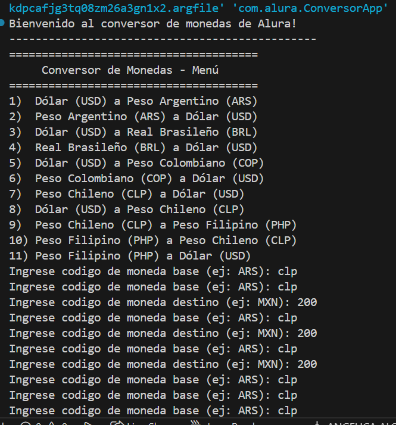

#  Conversor de Monedas - Alura

##  Descripción General

El **Conversor de Monedas** es una aplicación de consola desarrollada en **Java 21** que permite convertir valores entre diferentes monedas del mundo utilizando la API de **ExchangeRate-API**. La aplicación mantiene un historial de todas las conversiones realizadas y las exporta a un archivo JSON al finalizar.



### Características Principales

- Conversiones en tiempo real usando ExchangeRate-API
- Cualquier par de monedas soportado por la API
- Interfaz interactiva en consola
- Historial persistente de conversiones en JSON
- Arquitectura orientada a objetos con separación de responsabilidades
- Validación de entradas y manejo de errores

---

##  Estructura del Proyecto

```
src/main/java/com/alura/
├── ConversorApp.java                 (Punto de entrada)
└── model/
    ├── Conversor.java                (Orquestador / fábrica simple)
    ├── ConversionController.java     (Controlador: orquestador principal)
    ├── InputValidator.java           (Validación de entrada)
    ├── UIManager.java                (Mensajes e interacción con usuario)
    ├── ExchangeService.java          (Interfaz del servicio de cambio)
    ├── ExchangeRateApiService.java   (Implementación del servicio usando ExchangeRate-API)
    ├── HistoryManager.java           (Gestor del historial)
    └── HistoryEntry.java             (Modelo de una entrada de historial)
```

### Propósito de cada componente

- `ConversorApp.java`: Lanza la aplicación y delega al menú principal.
- `Conversor.java`: Construye e inyecta dependencias en `ConversionController`.
- `ConversionController.java`: Coordina la validación, la llamada al servicio y el almacenamiento en historial.
- `InputValidator.java`: Valida códigos de monedas y montos.
- `UIManager.java`: Muestra menús y mensajes al usuario.
- `ExchangeService` (interfaz) y `ExchangeRateApiService` (implementación): Realizan la conversión mediante el endpoint Pair de ExchangeRate-API.
- `HistoryManager.java` y `HistoryEntry.java`: Registran conversiones y exportan `conversion_history.json` usando `FileWriter`.

---

##  Flujo de Ejecución

1. `ConversorApp.main()` invoca `Conversor.eleccionUserMenu()`.
2. `Conversor` crea las dependencias e instancia `ConversionController`.
3. `ConversionController.run()` realiza un bucle interactivo:
   - Pide `base`, `target` y `amount` al usuario.
   - Valida con `InputValidator`.
   - Llama a `ExchangeRateApiService.convert(base, target, amount)`.
   - Muestra el resultado con `UIManager` y agrega una `HistoryEntry` a `HistoryManager`.
4. Al salir, `HistoryManager.saveToFile("conversion_history.json")` escribe el historial en JSON.

---

##  Requisitos y Ejecución

### Requisitos
- Java 21 o superior
- Maven (está incluido un wrapper `mvnw`)
- Conexión a Internet para la API


---

##  Interacción del Usuario

- Se solicita `base` (ej: `ARS`), `target` (ej: `USD`) y `amount` (ej: `1000`).
- Los códigos deben ser 3 letras (ISO 4217). El monto debe ser un número positivo.
- Si la conversión es exitosa, se muestra el resultado y se registra en el historial.
- Al finalizar, se guarda `conversion_history.json` en el directorio del proyecto.

Ejemplo de sesión:

```
Ingrese código de moneda base (ej: ARS): ARS
Ingrese código de moneda destino (ej: USD): USD
Ingrese monto a convertir: 1000
✓ Conversión exitosa: 1000.00 ARS = 5.1234 USD
¿Realizar otra conversión? (s/n): n
✓ Historial guardado exitosamente en: conversion_history.json
```

---

##  Formato de `conversion_history.json`

El archivo generado contiene un array JSON de entradas con la forma:

```json
[
  {
    "base": "ARS",
    "target": "USD",
    "amount": 1000.0,
    "result": 5.1234,
    "timestamp": "2025-11-14T15:30:45.123"
  }
]
```

---

##  Configuración de la API

La implementación por defecto almacena la API key en `ExchangeRateApiService.java`:

```java
private static final String API_KEY = "YOUR_API_KEY";
private static final String BASE_URL = "https://v6.exchangerate-api.com/v6/";
```

Recomendación: mover la clave a variables de entorno o a `application.properties` para mayor seguridad.

---

##  Buenas prácticas y extensibilidad

- `ExchangeService` es una interfaz: puedes añadir otras implementaciones (mock para tests, otro proveedor, etc.).
- `ConversionController` recibe dependencias por constructor, lo que facilita pruebas unitarias.
- `HistoryManager` usa `FileWriter` para cumplir el requisito; podrías cambiar a una biblioteca de JSON para serialización más robusta.

---

##  Solución de problemas

- "Campo conversion_result no encontrado": la API devolvió un error o formato distinto; verifica la clave y la conectividad.
- "Códigos inválidos": asegúrate de usar códigos ISO de 3 letras.
- "No se pudo guardar el historial": comprueba permisos de escritura en el directorio.

---

##  Referencias

- ExchangeRate-API: https://www.exchangerate-api.com/
- Java HttpClient: https://docs.oracle.com/en/java/javase/21/docs/api/java.net.http/java/net/http/HttpClient.html

---


